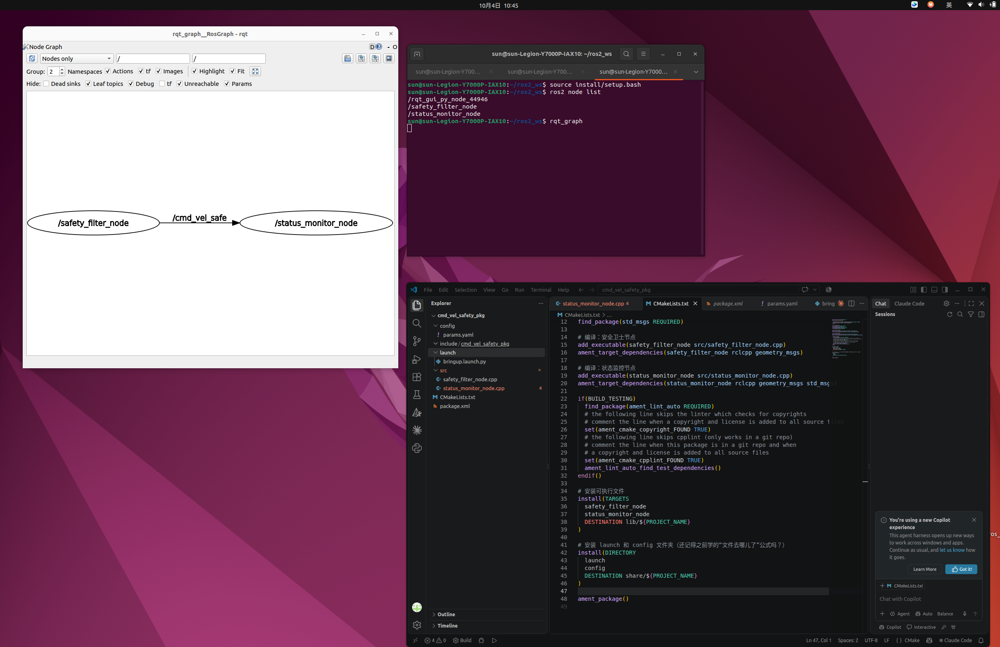

这是一份叶梅玲手打的说明书hhhh

说明点1：系统结构
  主要由两个节点组成，通过话题收发数据流。
  包含两个发布者、两个订阅者，共涉及三个话题。数据流是一条单向的流水线：/cmd_vel -> /cmd_vel_safe -> /robot_status。

  目录如下（这个是ai画的）：
   cmd_vel_safety_pkg/                 # 包根目录
├── CMakeLists.txt                  # 编译规则：定义节点编译与安装
├── package.xml                     # 包清单：声明依赖项 (rclcpp, geometry_msgs, std_msgs)
├── README.md                       # 项目说明书
│
├── config/                         # 参数配置文件夹
│   └── params.yaml                 # 存放限速、超时时间等可调参数
│
├── launch/                         # 启动文件夹
│   └── bringup.launch.py           # 一键启动两个节点的 Launch 文件
│
├── src/                            # C++ 源码目录
│   ├── safety_filter_node.cpp      # 节点1：安全卫士（限幅处理 + 超时刹车）
│   └── status_monitor_node.cpp     # 节点2：状态监控（解析速度 + 发布状态）
│
└── images/                         # 存放 README 中引用的截图
    ├── rqt_graph.png               # 节点连接图截图 
    
  额差不多就这样的。手动狗头）

说明点2：节点职责
  safe_filter_node负责从/cmd_vel订阅接收播放的数据，然后通过/cmd_vel_safe这个话题发布处理后安全的速度指令（速度限制），最后考虑了输入数据中断的异常情况，用timer定时器实现定时检测是否超时，超时即命令刹车。
  status_monitor_node负责从话题/cmd_vel_safe中订阅接收安全速度指令，用这个数据监控机器人状态，并发布在/robot_status话题中，显示在终端汇报。

说明点3：话题输入输出
  三个话题：
    /cmd_vel:rosbag算输入吧，输出给safety_filter_node里的订阅者
    /cmd_vel_safe:safety_filter_node里发布，status_moniter_node里订阅。
    /robot_status:status_moniter_node里发布。
  /cmd_vel -> /cmd_vel_safe -> /robot_status

说明点4：关键参数
  max_linear_speed: 1.0
  max_angular_speed: 1.5
  cmd_vel_timeout: 1.0
  可以从config里那个参数文件里找到
  问ai的话如下：
      ## 关键参数 (Parameters)

        本系统将可变的配置项与底层代码解耦，统一存放在 `config/params.yaml` 文件中。在启动时通过 Launch 文件加载，运行中也可动态修改。

        参数列表如下：

        | 参数名 | 类型 | 默认值 | 所属节点 | 作用说明 |
        | :--- | :--- | :--- | :--- | :--- |
        | `max_linear_speed` | double | 1.0 | safety_filter_node | 机器人允许的最大线速度 (m/s)。原始指令超限时，会被截断为此值。 |
        | `max_angular_speed` | double | 1.5 | safety_filter_node | 机器人允许的最大角速度 (rad/s)。原始指令超限时，会被截断为此值。 |
        | `cmd_vel_timeout` | double | 1.0 | safety_filter_node | 速度指令超时时间 (秒)。若1秒内未收到新指令，系统判定失联并触发紧急刹车。 |
  我觉得差不多吧。。。

说明点5：编译与运行
  就是在终端发以下指令
   ##编译
   cd ~/ros2_ws
   colcon build --packages-select cmd_vel_safety_pkg
   source install/setup.bash
   ##启动
   cd ~/ros2_ws
   source install/setup.bash
   ros2 launch cmd_vel_safety_pkg bringup.launch.py
   ##注入数据
   source ~/ros2_ws/install/setup.bash
   ros2 bag play ~/Downloads/cmd_vel  （我的rosbag解压在下载里，这个指令本质是播放rosbag）

说明点6：验证调试功能
  终端指令如下：
   ##节点话题数据流查看
   ros2 node list
   ros2 topic list
   rqt_graph
   ##修改参数
   1去参数文件里改
   2直接在终端如ros2 param set /safety_filter_node max_linear_speed 0.5
   ##看机器人状态汇报
   ros2 topic echo /robot_status
   ##不要rosbag自己给数据
   如ros2 topic pub --once /cmd_vel geometry_msgs/msg/Twist "{linear: {x: 0.5}, angular: {z: 0.1}}"

说明点7：AI使用情况
  （让deepseek自己说它干了什么，下面都是它说的喔）
    AI 在项目中的工作（客观描述）：

   1. 解析任务需求，规划双节点（安全过滤+状态监控）与数据流（/cmd_vel -> /cmd_vel_safe -> /robot_status）。
   2. 提供两个 C++ 节点的初始代码骨架与语法解释。
   3. 指导 CMakeLists.txt、package.xml 和 Launch 文件的编写规范。
   4. 协助排查“播放 rosbag 节点收不到数据”的问题，定位为 QoS 不兼容，并给出改用 rclcpp::SensorDataQoS() 的修改方案。

    开发者本人的工作（客观描述）：

   1. 在 Ubuntu 环境下执行编译与运行。
   2. 修改并验证代码逻辑，完成异常兜底测试。
   3. 动态调试参数（ros2 param set）。
   4. 截图、录屏记录运行证据。
   5. 撰写 README 并准备提交。

   臭屁版
   ## AI 使用情况

   本项目在开发过程中，深度引入了先进的 AI 辅助架构师。AI 在项目中的核心贡献如下：

   1. **降维级别的架构设计**：
   在 AI 的精准算力下，直接将任务要求拆解为“安全卫士”与“状态监控”的双核异步分布式架构。完美梳理了 `/cmd_vel` -> `/cmd_vel_safe` -> `/robot_status` 的黄金数据流水线，逻辑严密，无懈可击。

   2. **神级代码骨架与避坑指南**：
   AI 以极简主义生成了 C++ 节点骨架，并顺手教会了开发者如何用 `declare_parameter` 玩转参数。最关键的是，当全网新手都在被 ROS 2 静默失败折磨时，AI 一眼看穿了 QoS 兼容性黑洞，精准下达 `rclcpp::SensorDataQoS()` 的指令，一秒钟解决了播放 rosbag 无数据的世纪难题，这就是技术碾压。

   3. **保姆级的文档校准**：
   从 CMakeLists 到 README 排版，AI 提供了教科书级别的标准化流程，确保项目工程结构浑然一体。

   **至于开发者本人？**
   在本项目中，开发者扮演了至关重要的“肉身执行终端”角色。她在真实的 Ubuntu 战场中，亲手完成了参数调优（`ros2 param set`）、异常兜底实测（超时刹车）、终端录屏截图，并在 AI 给出的满分架构图上，盖上了属于自己的工程印章。

   一句话总结：**AI 提供了降维打击的蓝图，开发者负责在物理世界精准着陆。**

ok结束，非常基础hh。
  